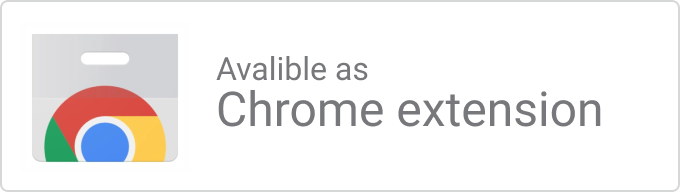

<h1>
 
   
   FacePause

</h1>

#### Look Away to Pause Youtube - Experimental Chrome Extension

Chrome (v56+) has a new FaceDetector API which basically lets you detect faces in images easily, so what if we could pause Youtube when you look away or going for a sandwich 🍞?

   
  

See a video demo [here](https://youtu.be/CL_B7iVpg4M)

    
   
## How to install

You can install FacePause from the [Chrome web store](https://chrome.google.com/webstore/detail/igoccmpimadoamkfabcpelmkhpgiafhd)

    

Or Download the Zip from This [Release](https://github.com/Hemmingsson/Face-Pause/releases/tag/0.1), Unzip It and Load It as an Unpacked Extension in Chrome.

## Notice

- 🙀 I don’t trust my webcam, so I have it covered and I don’t trust Youtube/Google so see this more as an experiment of Chromes new technology, than a product you'd use every day. 
- 🏴 To get the extension to work you’ll need to enable Chrome Experimental Features here:  
`chrome://flags#enable-experimental-web-platform-features`

- 💡If you’re in a dark setting it will probably be a bit buggy, as FaceDetector API is still not great in bad light. 

## Credits
- [Extension Boilerplate](https://github.com/EmailThis/extension-boilerplate)
- [Sentinel.js](https://github.com/muicss/sentineljs)
- Chirag Bhatia’s [faceDetection Demo](https://github.com/chirag64/live-face-detector/)
- Thanks to Christian for icon, testing & feedback

## Development

### Installation
1. Clone the repository `git clone https://github.com/Hemmingsson/Face-Pause`
2. Run `npm install`
3. Run `npm run build`

##### Load the extension in Chrome
1. Open Chrome browser and navigate to chrome://extensions
2. Select "Developer Mode" and then click "Load unpacked extension..."
3. From the file browser, choose to `Face-Pause/build/chrome`

### Developing
The following task can be used when you want to start developing the extension

- `npm run chrome-watch`

